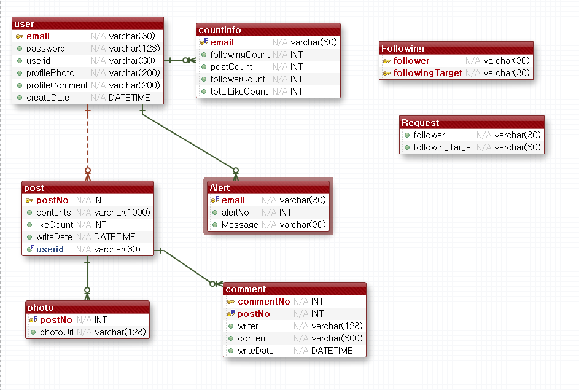

###  웹 디자인 프로젝트 (3팀 : 짬뽕)

> 배포 URL: http://i3a303.p.ssafy.io/


### - 프로젝트 소개 

#### :name_badge: 프로젝트 이름
코스모스 

#### :page_facing_up: 프로젝트 개요
코스모스는 놀거리 코스 공유 SNS 입니다.

사용자가 직접 가보고 체험해본 맛집, 카페 등의 먹거리와 다양한 놀거리 장소들을 코스로 묶어 그 경로와 정보들을 공유하는 서비스입니다. 서비스 자체에서 제공하는 정보가 아닌 사용자들이 직접 코스정보를 업로드하도록 하여 다양한 의견의 정보들을 보여줄 수 있도록 차별성을 두었습니다. SNS의 기본기능인 좋아요와 댓글, 팔로우, 알림, 유저검색, 게시물업로드 기능을 포함하며 추가적으로 장소검색, 길찾기, (사용자 취향 맞춤 추천, 태그기능) 도 구현하였습니다.

### :two_men_holding_hands: 프로젝트 팀원 및 역할

####  김동현 : Leader, Backend

#### 이정훈 : CTO, Backend

####  최연희 : Backend

####  최예인 : Frontend

####  김주형 : Frontend

#### :computer: 사용언어 및 기술스택

1. java : zulu-8

   1. spring boot
   2. maven
2. Spring Boot
3. Maven
4. Vue.js
5. node.js
6. javascript

   1. nodejs
   2. yarn
   3. Vue-cli : ``` yarn add global @vue/cli ``` 
   4. Sass : ``` yarn add node-sass sass-loader ```
   5. Vue-router, Vuex : ```yarn add vue-router vuex```
7. yarn
8. vue-cli
9. Docker


* DB

1. docker

2. mariadb 

   ```docker run --name maria-db -p 3306:3306 -e MYSQL_ROOT_PASSWORD=mariadb -d maraidb```

   ```docker exec -it maria-db mysql -u root -pmariadb```

   ```create database `ssafy-sk`; ```

   이후 backend 폴더 안에 있는 database.sql 실행

3. Firebase


## - 프로젝트 사용방법

### :floppy_disk: Install

> Using yarn

### Project setup

```bash
yarn install
```

### Compiles and hot-reloads for development

```bash
yarn serve
```

### Compiles and minifies for production

```bash
yarn build
```

### Lints and fixes files

```bash
yarn lint
```

### Customize configuration

See https://cli.vuejs.org/config/


## - 프로젝트 주요 기능

### :world_map: 장소 검색 및 지도상의 위치 표시 - 카카오 Maps API 활용(http://apis.map.kakao.com/) 

          


### :information_source: 장소의 이미지 및 정보 크롤링 - Jsoup 라이브러리 활용(https://jsoup.org/)

             


### :a: 태그 기능 - 코모란 (키워드 추출) 라이브러리 활용(https://docs.komoran.kr/)


### :heart: 사용자 취향 맞춤 코스 추천 기능 - 알고리즘

     


## - 프로젝트 개발 과정

###  Wire Frame


###  DB 목록 및 ERD

User, CountInfo, Feed, Love, Photos, Comments, Following, Alert, Request, Course




###  REST API


